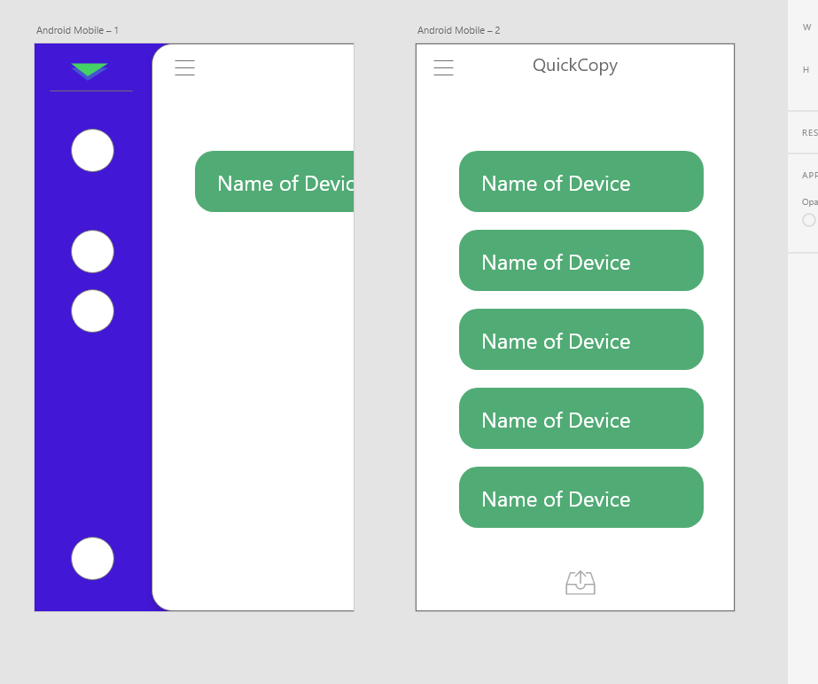

<h1 align="center">🏹 QuickCopy 💾</h1>

A universal application that allows for easy and frictionless data transfer between devices on a network

<a>

</a>

<a>

</a>

  <a style="padding: 0 10px;" href="#what-is-it">What is it</a> •
  <a style="padding: 0 10px;" href="#installation">Installation</a> •
  <a style="padding: 0 10px;" href="#getting-started">Getting Started</a>

<b>Made by Leonardo Puzzuoli</b>

<h4 align="left">What is it</h4>
How often have you struggled at sending a file between your phone and your computer?
We are in the year 2019 and yet it is still a frustration to send a small link or document from one device to another. The existing option, Bluetooth is a mess of it's own; pairing issues, achingly slow connections and a limited range mean that most people resort to sending themselves files over email or cloud storage, but is there really no better option?
Apple has clearly put thought into this problem and came up with AirDrop, but in typical Apple style, they have reserved the use of the technology to their own, and only between their own devices.

 QuickCopy is meant to fix that. It is the solution for everyone. Compatible with all devices and using WIFI rather than Bluetooth it finds all enabled devices on your network in a heartbeat, and simpy allows you to send links and files without much hassle.

> <b>Note</b>: This product is still in alpha stage, one or more features may not work properly yet. See more under status tab.

<h4 align = "left"> Installation</h4>

 The alpha version for QuickCopy in available under the releases tab. To be notified on full-release star or watch this project. Otherwise you can download and compile the latest source code

<h4 align = "left"> Why QuickCopy</h4>

QuickCopy is built to run natively on all desktop operating systems and features native notifications  

  
and a beautiful modern customisable design   

  for mobile and desktop   
(WIP)
  
But most importantly QuickCopy features seamless implementation into you daily workflow allowing you to  copy data between linked devices via shared clipboard or by using the fast send option in your PC's status bar.  
So what are you waiting for. Download QuickCopy now!
<!--

-->

<h4 align = "left"> Status</h4>

Design desktop app ✓ 
Create desktop app *75% done* 
<pre>
 {
 - Create UDP Server ✓
 - Create TCP Server ✓
 - Create TCP Client ✓
 - Discover devices on network ✓
 - Send text through socket ✓
 - Implement Designs: Scan ✓, Package ✓ Traffic ✗, Settings ✓
 - Send files ✓
 - System bar ✓
 - Notification ✓
 - Encryption ✗
 - Send packages ✓
 - polishing ✗
 }
</pre>
Design mobile app ✓ 
Create mobile app

